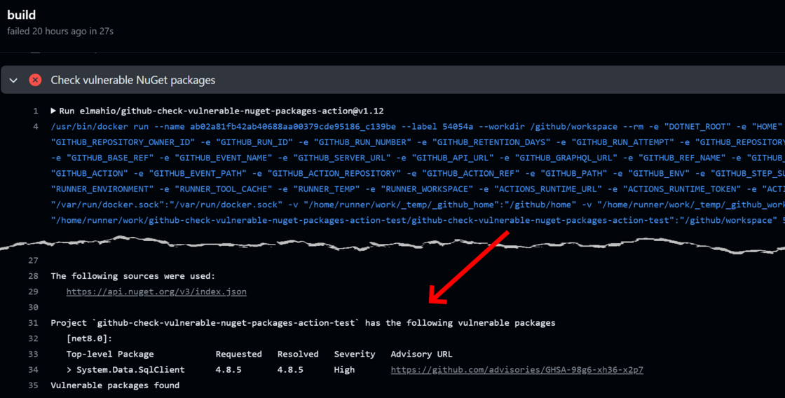

# Check vulnerable NuGet packages GitHub Action

This action will check for vulnerable NuGet packages in one or more projects/solutions. If vulnerable packages are found, they will be listed and the build will fail.



The code is based on [this excellent blog post by Steven Giesel](https://steven-giesel.com/blogPost/a825c041-26dc-4488-8707-17697871d08e). Development of the action is sponsored by [elmah.io](https://elmah.io).

## Inputs

### `projects`

A newline-separated list of project or solution files to operate on. If not specified, the command will search the current directory for one.

## Example usage

Check all projects and solutions for vulnerable NuGet packages:

```yml
- name: Check vulnerable NuGet packages
  uses: elmahio/github-check-vulnerable-nuget-packages-action@v2
```

Check a specific project for vulnerable NuGet packages:

```yml
- name: Check vulnerable NuGet packages
  uses: elmahio/github-check-vulnerable-nuget-packages-action@v2
  with:
    projects: |
      src/HelloWorld.csproj
```